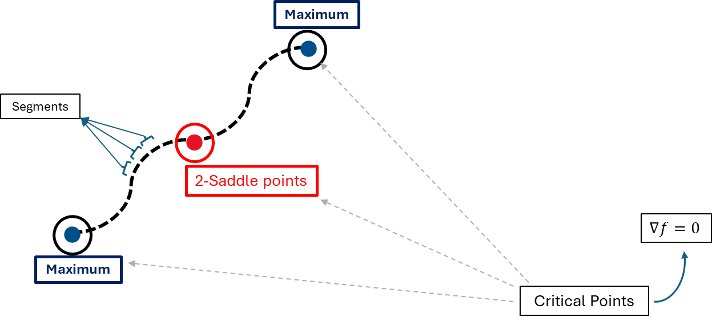

# Relics of Reionization in Cosmic Dawn III: Physical Properties of the Remnants of Photo-Evaporated Filaments and Structures

This description of the thesis is supposed to summarise the entire work, as a means to present it to potential collaborators.

- The thesis report is available [here](link). 
- Programming/libraries : Python (numpy, scipy, matplotlib, pandas, scikit_learn)
- Data source : [Cosmic Dawn III (CoDaIII)](https://coda-simulation.github.io/) simulation.
- Additional tool : [DisPerSE](https://www2.iap.fr/users/sousbie/web/html/index3c4a.html?category/Overview)

## Introduction

Cosmic filaments are fundamental components of the [large-scale structure](https://science.nasa.gov/universe/galaxies/large-scale-structures/) of the Universe, forming the intricate network known as the [cosmic web](https://science.nasa.gov/resource/cosmic-web/). These elongated structures, which stretch over vast distances, play a pivotal role in shaping galaxy formation and evolution. By acting as conduits for matter and energy, filaments transport gas and dark matter from the intergalactic medium (IGM) into galaxies, fueling star formation and the growth of galactic halos. Despite their importance, the detailed physical and thermodynamic properties of these filaments remain elusive due to their faintness and the challenges involved in observing them directly.

This thesis investigates the evolution of [cosmic filaments](https://en.wikipedia.org/wiki/Galaxy_filament) during the [Epoch of Reionization (EoR)](https://en.wikipedia.org/wiki/Reionization), a transformative period in the history of the Universe when the first stars and galaxies emerged, producing ionizing radiation that altered the state of the IGM. Using data from the [Cosmic Dawn III (CoDaIII)](https://coda-simulation.github.io/) simulation—a high-resolution, cosmological radiation-hydrodynamics simulation—the study aims to understand how the inhomogeneous reionization process impacts the physical characteristics of large scale structures and galaxy evolution. By analyzing their evolution across multiple redshifts (z = 15, 9, 7, and 5), my thesis addresses critical questions about how the growing background radiation alters filamentary structures, how their density, temperature, and ionization state evolve over time, and what these changes reveal about the dynamics of the cosmic web

<!--  -->

The scope of this study includes a sub-region of the CoDaIII simulation box, chosen to balance computational constraints with the need for detailed analysis. Through this focused investigation, the research contributes to a broader understanding of the role of cosmic filaments in the hierarchical assembly of matter in the Universe, particularly during a period characterized by rapid and spatially variable reionization.

## Methodology

<!-- Floated container with two images side by side -->

  <figure style="margin: 0; text-align: center; display: flex; flex-direction: column; align-items: center;">
    
    <figcaption>Figure 1: Before reionization</figcaption>
  </figure>

  <figure style="margin: 0; text-align: center; display: flex; flex-direction: column; align-items: center;">
    
    <figcaption>Figure 2: After reionization</figcaption>
  </figure>

<!-- Text that appears before the floated images -->

The Cosmic Dawn III simulation captures the complex interplay between ionizing radiation and the matter in the IGM, making it an ideal tool for exploring how cosmic filaments respond to reionization. With a resolution sufficient to resolve individual filamentary structures, CoDaIII employs the RAMSES-CUDATON code to couple radiation transport, hydrodynamics, and dark matter dynamics. This allows the simulation to account for the escape of ionizing radiation from thousands of galaxies and the subsequent impact on their surrounding environments.

  
- The first step in the analysis involved extracting the filamentary network 
using <a href="https://www2.iap.fr/users/sousbie/web/html/index3c4a.html?category/Overview">DisPerSE</a> 
(DIScrete PERsistent Structures Extractor), an open-source tool that identifies 
critical points and connects them to delineate filamentary structures. This 
approach relies on persistence analysis to distinguish meaningful features 
from noise within the simulation’s density field. By setting a uniform 
persistence threshold across all analyzed redshifts, my study ensured 
consistency in identifying filaments while enabling comparisons of their 
properties over time.

<!-- 

  <figure style="text-align: center; width: 48%; margin: 0;">
    
    <figcaption>Figure 1: Basic definition of a filament</figcaption>
  </figure>

-->

- Once the filaments were identified, their spatial and thermodynamic properties were analyzed using radial profiling techniques. This involved characterizing the regions around each filament for parameters such as baryonic density, dark matter density, temperature, neutral fraction, and metallicity. The analysis was further refined by categorizing filament segments based on their local density, allowing for a more nuanced understanding of how filaments with different physical properties evolve through the EoR.

## Results

The study revealed several important trends in the evolution of cosmic filaments. As the Universe transitioned from a neutral to an ionized state, the density distribution of the filamentary network changed significantly. Higher-density filaments became more prevalent over time, reflecting the effects of gravitational collapse and radiative feedback from ionizing sources. By contrast, lower-density regions of the network diminished, likely due to the combined effects of radiation pressure and the hierarchical growth of structure.

Temperature profiles showed a clear increase as a function of decreasing redshift, highlighting the progressive heating of the IGM by ionizing sources. High-density filaments developed distinct thermal envelopes, with peak temperatures observed at increasing distances from their central axes over time. This outward expansion of the heated regions suggests a dynamic interplay between radiation and the gravitational potential of the filaments. Interestingly, while lower-density filaments also experienced heating, they lacked the pronounced temperature peaks seen in their higher-density counterparts.

The analysis of neutral fraction profiles revealed a shift in the ionization pattern as reionization progressed. At early redshifts, dense regions of the filamentary network were the first to become ionized, driven by their proximity to radiation sources. By later stages of the EoR, the ionization process transitioned to an outside-in pattern, with less dense regions becoming the most ionized. This reversal highlights the complex interplay between gas density and radiation field strength in shaping the ionization state of the IGM.

Metallicity profiles provided additional insights into the effects of stellar feedback on the filamentary network. Only the highest-density filaments exhibited significant levels of metallicity, reflecting their connection to regions of active star formation. The presence of metals in these regions likely contributed to the observed temperature peaks, although the exact role of supernova feedback remains uncertain.

## Conclusions

This thesis underscores the importance of cosmic filaments as dynamic and evolving structures within the cosmic web. By leveraging the capabilities of the Cosmic Dawn III simulation and advanced data analysis techniques, the study provides a detailed characterization of how filaments respond to the spatially and temporally variable reionization process. The findings highlight the dual influence of gravitational dynamics and radiative feedback in shaping the physical and thermodynamic properties of filaments, offering new insights into their role as conduits of matter and energy in the Universe.

While the results are based on a limited sub-region of the CoDaIII simulation, they serve as a foundation for future studies aimed at generalizing these findings to larger volumes and exploring additional properties, such as gas velocity. Moreover, the methodologies developed in this research have broader applications in the study of large-scale structure, demonstrating the transferability of these data science techniques to other cosmological simulations and observational datasets.

In summary, this research contributes to our understanding of the cosmic web during the EoR and provides a framework for further exploration of the complex interactions between radiation, matter, and gravity in shaping the Universe’s largest structures.

## Key References

1. [How to Quench a Dwarf Galaxy](https://academic.oup.com/mnras/article/494/2/2200/5780248) 
2. [Rivers of gas – I. Unveiling the properties of high redshift filaments](https://academic.oup.com/mnras/article/502/1/351/6074265)
3. [Cosmic Dawn (CoDa): the first radiation-hydrodynamics simulation of reionization and galaxy formation in the Local Universe](https://academic.oup.com/mnras/article/463/2/1462/2892403)
4. [Cosmic Dawn II (CoDa II): a new radiation-hydrodynamics simulation of the self-consistent coupling of galaxy formation and reionization](https://academic.oup.com/mnras/article/496/4/4087/5836727)

and many more. 
